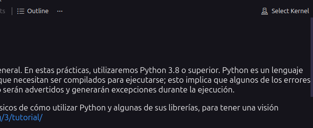
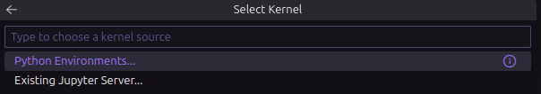
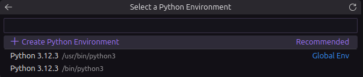
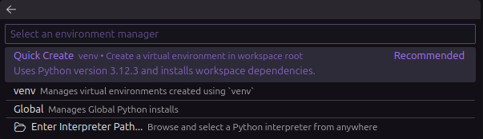

# Practica Guiada 0 - Introducción a Python

Este repositorio contiene el código de la práctica guiada "Introducción a
Python" de la asignatura Software Avanzado Radar (SARA) del Master en Sistemas
Radar.

El repositorio contiene las siguientes carpetas necesarias para la práctica:
 
- `notebooks`: contiene los notebooks de Jupyter que van a ser utilzados durante
la práctica.
- `documentation`: contiene el enunciado de la práctica y ayudas extra.

## Preparación entorno

Durante esta práctica guiada utilizaremos notebooks como guía y para ejecutar el
código de prueba. La forma recomendada en la asignatura de utilizar los
notebooks es de forma local utilzando el editor
[Visual Studio Code](https://code.visualstudio.com/). Además es un requisito
tener python instalado en el sistema operativo. La versión de python debe ser
superior a la 3.8, aunque se recomienda la 3.14.3 en adelante por el trabajo
centrado en concurrencia de la asignatura.

Una vez cumplamos los requisitos mínimos abriremos dentro deVisual Stuido Code
el notebook `1. Introducción a Python.ipynb` dentro de la carpeta `notebooks`.
Es muy importante configurar el entorno de python donde se va a ejecutar el
código escrito en el notebook.

Para esto primero hacemos clic en la opción `Select Kernel` en la barra superior
del notebook y seleccionamos `Change kernel`.

Tras esto aparecerá un menú de selección como este, en el que pincharemos en la
opción `Python Environments...`

En la siguiente pantalla seleccionamos la opción `Create Python Environment`
para tener un entorno de python unicamente de este proyecto y no afectar a otros proyectos.

Esto creará un entorno en la carpeta principal del proyeto con el nombre `.venv`
que será el usado para nuestra ejecución. A partir de ahora podemos empezar a
ejecutar el código de los notebooks sin problema.
