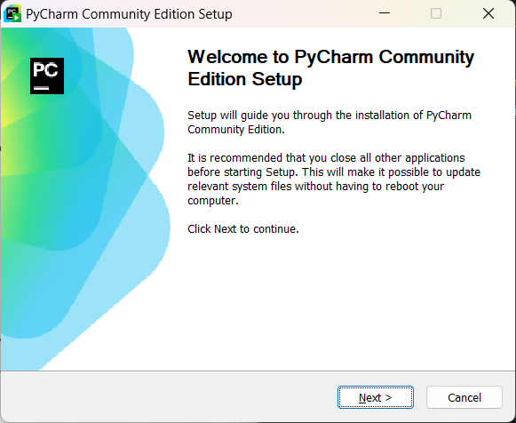

# Pycharm Community Edition (PycharmCE)

Este documento describe el proceso de instalación del IDE recomendado para la 
realización de las prácticas de la asignatura Software Avanzado Radar (SARA) 
del Master en Sistemas Radar. También se incluye la instalación de Python, 
software necesario para la ejecución del software desarrollado. 

Las imágenes han sido tomadas en el sistema operativo Windows. Para sistemas 
operativos como MAC y Linux se pueden seguir las instrucciones de las páginas 
oficiales. 

## Instalación Python
Es primer paso es descargar [Python](
https://www.python.org/downloads/windows/) y ejecutar el archivo descargado. 
REcuerde que la versión necesaria tiene que ser superior a la 3.8. Se 
recomienda descargar e instalar la última revisión de la versión 3.12.

## Instalación PycharmCE
1. El primer paso será acceder a la página web de descarga de [Pycharm](
https://www.jetbrains.com/pycharm/download/) y descargar el instalador. Es 
importante que descargue la versión de la **COMUNIDAD** y no la versión
profesional. 

2. Tras ejecutar el instalador, sigas sus instrucciones, las opciones por 
defecto son adecuadas. Al llegar a la fase de instalación de la imagen 
asegurese de seleccionar las opciones marcadas en la imagen. 

3. Durante las siguientes fases de la instalación puede continuar con las 
opciones por defecto hasta llegar a la última fase. Debido a los cambios que 
tiene que realizar el IDE instalado es necesario reiniciar el ordenador. Hasta 
que 
