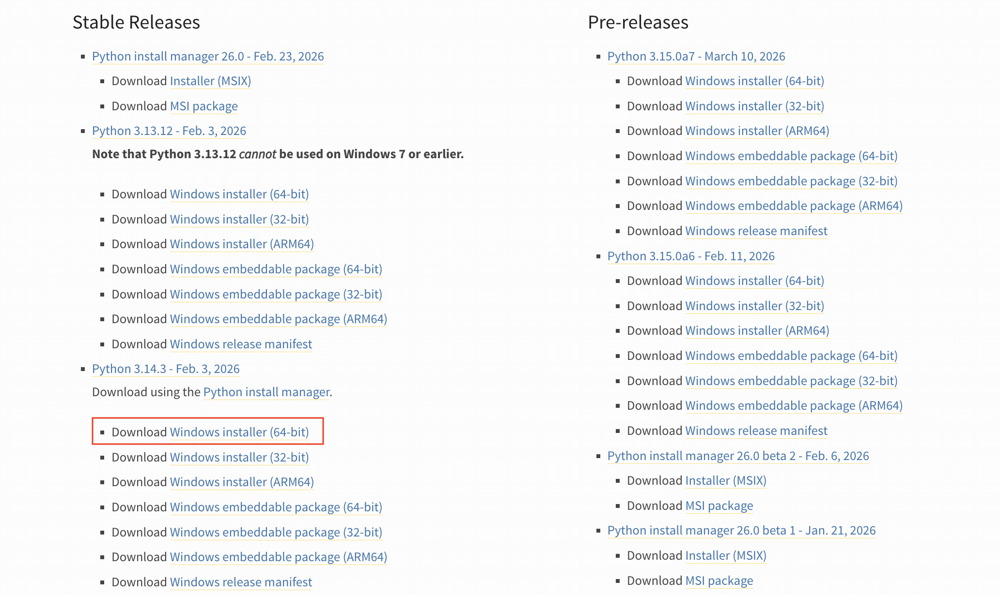
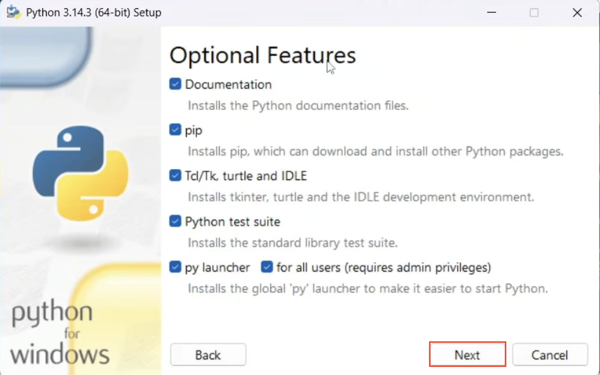
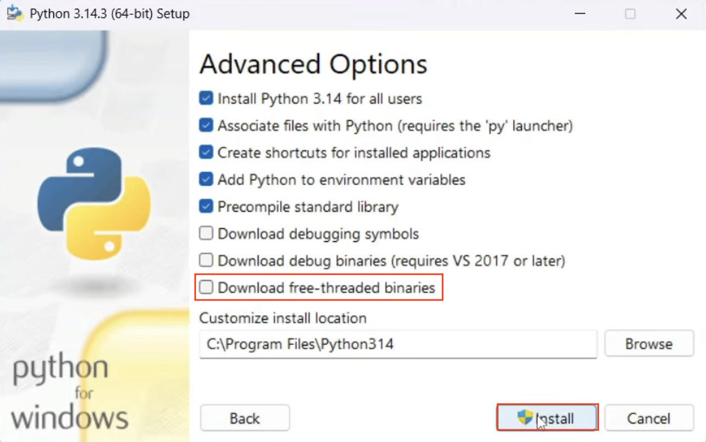

# Guía Instalación de Python free-threading en Windows

En esta guía se explica cómo instalar la versión 3.14.3t de Python en Windows. La especificación `t` indica la versión de Python llamada *free-threading*, compilada sin el Global Interpreter Lock (GIL). Esta versión permite una concurrencia real en aplicaciones multihilo.

> ⚠️ Nota: Esta versión es experimental y algunas librerías pueden no ser totalmente compatibles.

---

## Pasos para la instalación

### 1. Descargar el instalador de Python para Windows

Visite la página oficial:

https://www.python.org/downloads/windows/

Descargue el instalador de **Python 3.14.3 (64-bit)**.



---

### 2. Ejecutar el instalador

Ejecute el instalador y asegúrese de marcar:

- ✅ **Add Python to PATH**
- ✅ **Use admin privileges when installing py.exe**


Seleccione "**Customize installation**".

---

### 3. Opciones avanzadas

Seleccione las opciones que se muestran en la imagen y continúe con "Next".



---

### 4. Free-threaded binaries (IMPORTANTE)

⚠️ En esta pantalla debe seleccionar:

- ✅ **Free-threaded binaries**

Si no selecciona esta opción, instalará Python con GIL (justo lo que no queremos para la asignatura).



---

## Verificación de la instalación

### 1. Verificar versión específica

Ejecute en un terminal:

```bash
py -3.14t --version
````

Debería mostrar:

```
Python 3.14.3t
```
