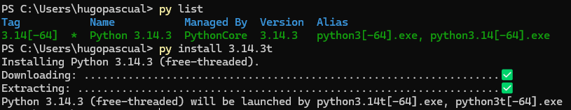
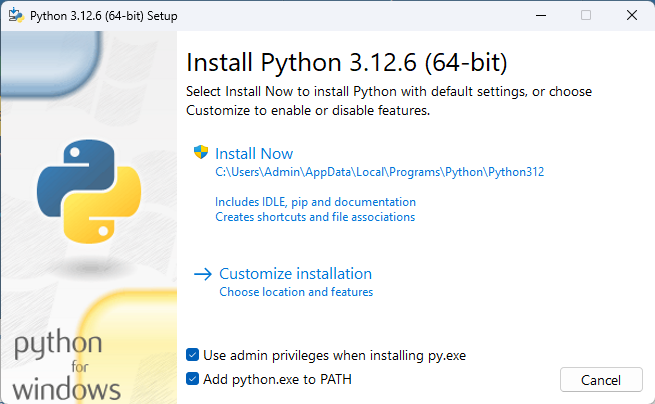

# Python

Recomendadmos la versión 3.14.3t para la realización de las prácticas,
pero en todo caso debe ser la versión 3.8 o superior. Es importante que la
versión de python tenga la `t` para que podamos utilizar las caraterísticas de
hilos y concurrencia reales.

En el caso de la versión 3.14 la
[documentación oficial](https://www.python.org/downloads/windows/) recomienda la
instalación mediante la
[Windows store](https://apps.microsoft.com/detail/9nq7512cxl7t?ocid=webpdpshare)
de manera que primero instalamos la plataforma de python y luego las diferentes
versiones.

## Instalación

Una vez descargado el instalador de plataforma de python lo ejecutamos y
seguimos los pasos de instalación. Se abrirá una terminal donde se nos
preguntarán algunas opciones de configuración, responda que sí a todas.


Una vez finalizada la instalación, debemos instalar la versión concreta de
python que usaremos. Para esto abrimos la PowerShell de Windows y ejecutamos el
siguiente comando:

```powershell
py install 3.14.3t
```



Esto descargará e instalará la versión de python 3.14.3t en nuestro sistema. A
partir de ahora podremo seleccionar en VScode la versión de python 3.14.3t para
ejecutar el código o crear el entorno virtual.

## Versiones antiguas

En el caso de versiones inferiores puede seguir la siguiente guía:

El primer paso es descargar el instaladro de
[Python](https://www.python.org/downloads/) adecuado y ejecutar el archivo
descargado.



Tras terminar la instalación, se le ofrece la opción de eliminar el tamaño
máximo de nombre de los archivos, no es necesario.


