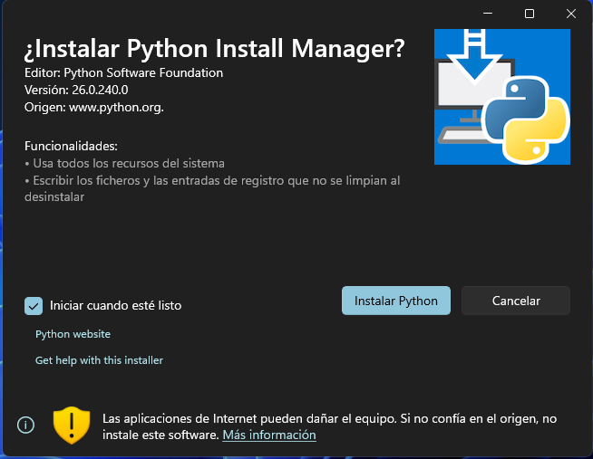
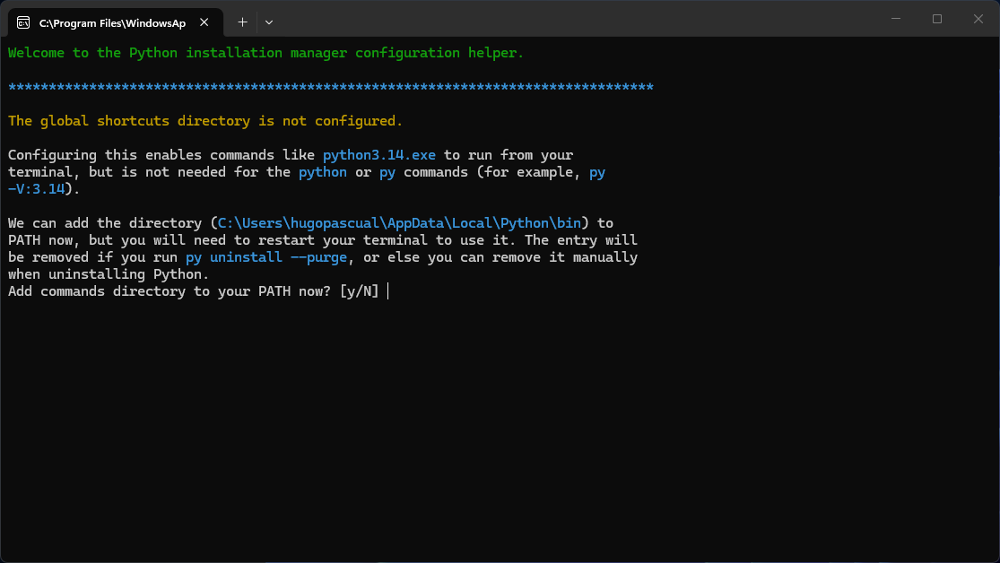
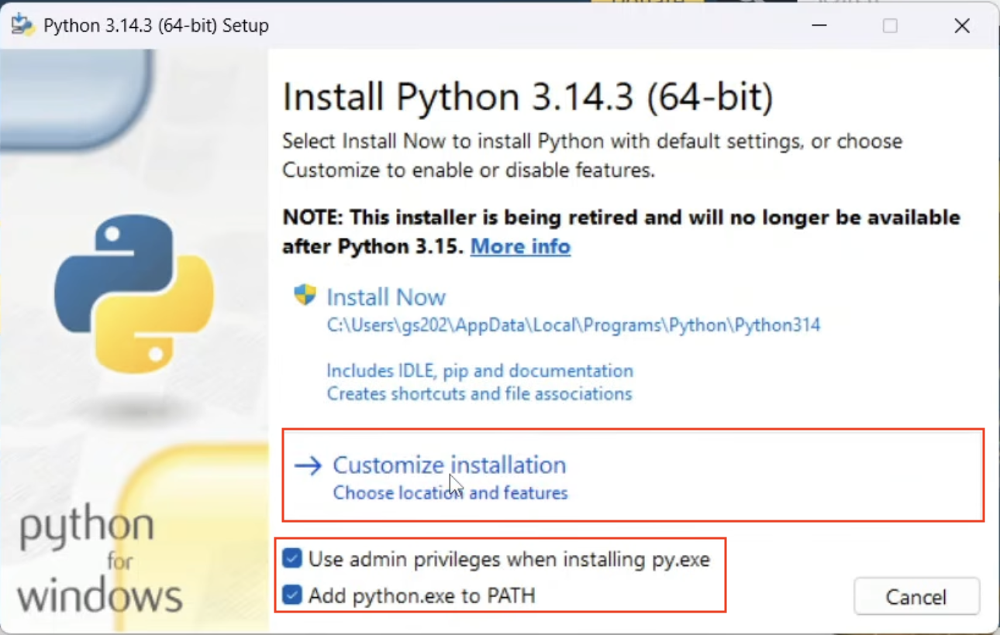
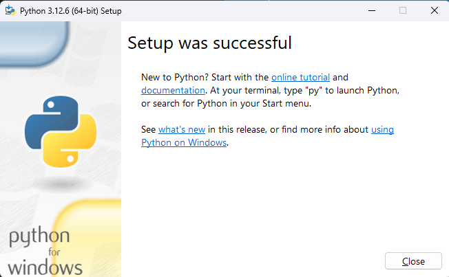

# Python

Recomendadmos la versión 3.14.3t para la realización de las prácticas,
pero en todo caso debe ser la versión 3.8 o superior. Es importante que la
versión de python tenga la `t` para que podamos utilizar las caraterísticas de
hilos y concurrencia reales.

En el caso de la versión 3.14 la
[documentación oficial](https://www.python.org/downloads/windows/) recomienda la
instalación mediante la
[Windows store](https://apps.microsoft.com/detail/9nq7512cxl7t?ocid=webpdpshare)
de manera que primero instalamos la plataforma de python y luego las diferentes
versiones.

## Instalación mediante plataforma de Python

Una vez descargado el instalador de plataforma de python lo ejecutamos y
seguimos los pasos de instalación. Se abrirá una terminal donde se nos
preguntarán algunas opciones de configuración, responda que sí a todas.





Una vez finalizada la instalación, debemos instalar la versión concreta de
python que usaremos. Para esto abrimos la PowerShell de Windows y ejecutamos el
siguiente comando:

```powershell
py install 3.14.3t
```


Esto descargará e instalará la versión de python 3.14.3t en nuestro sistema. A
partir de ahora podremo seleccionar en VScode la versión de python 3.14.3t para
ejecutar el código o crear el entorno virtual.

## Instalación directa

En ocasiones la instalción mediante la plataforma da problemas si ya existe una
versión de python instalada. En estos casos se puede realizar una instalación
directa de la versión adecuada. El instalador se puede descarga de la
[página oficial](https://www.python.org/downloads/windows/)


Una vez descargado el instalador ejecutelo y asegúrese de marcar las siguientes
opciones:

- Add Python to PATH
- Use admin privileges when installing py.exe



A continuación seleccione `Customize installation` y seleccione las opciones que
se muestran en la imagen.


En la siguiente pantalla es muy importante marcar la opción
`Download free-threaded binaries`. Tras esto la instalación finalizará.


Una vez instalado python puede verificar la instalción con el siguiente comando:

```shell
py -3.14t --version
```

## Versiones antiguas

En el caso de versiones inferiores puede seguir la siguiente guía:

El primer paso es descargar el instaladro de
[Python](https://www.python.org/downloads/) adecuado y ejecutar el archivo
descargado.


Tras terminar la instalación, se le ofrece la opción de eliminar el tamaño
máximo de nombre de los archivos, no es necesario.


