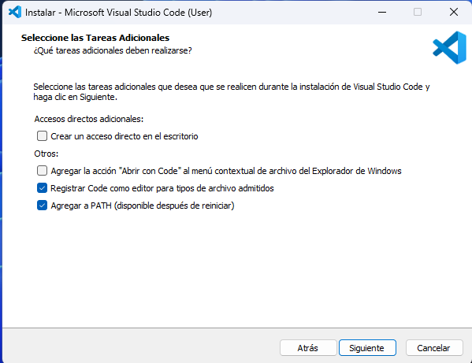
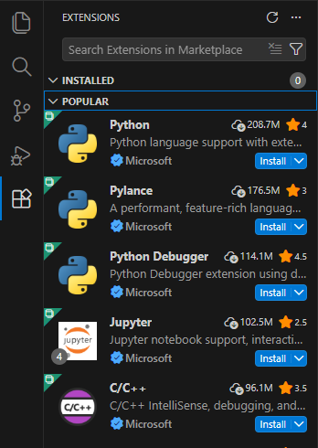

# Visual Studio Code (VSCode)

Este documento describe el proceso de instalación del IDE recomendado para la
realización de las prácticas de la asignatura Software Avanzado Radar (SARA)
del Master en Sistemas Radar. También se incluye la instalación de Python,
software necesario para la ejecución del software desarrollado.

Las imágenes han sido tomadas en el sistema operativo Windows. Para sistemas
operativos como macOS y Linux se pueden seguir las instrucciones de las páginas
oficiales.

## Instalación Visual Studio Code

Acceda a la página web de descarga de
[Visual Studio Code](https://code.visualstudio.com/) y descargue el instalador.
Es importante que descargue la versión adecuada para su sistema operativo.

### Windows

Ejecute el archivo descargado y siga las instrucciones del instalador. Es
recomendable marcar las siguientes opciones:

Una vez instalado, abra Visual Studio Code y acceda a la sección de extensiones.
Busque e instale la extensión `Python`.

